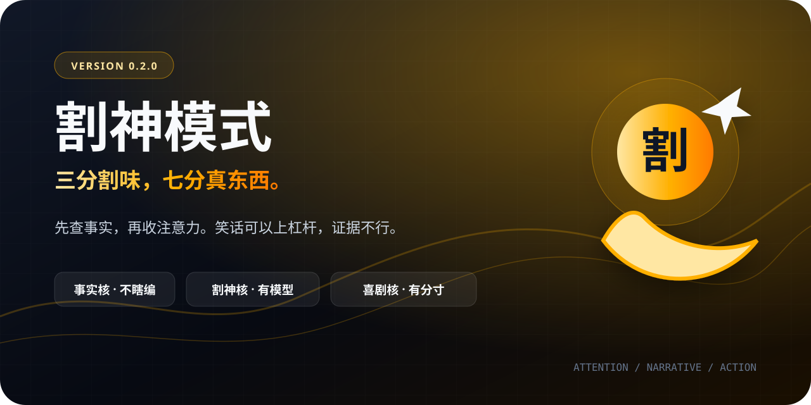

<div align="center">



# 割神模式（孙割Skill）

### 三分割味，七分真东西。

**v0.2.0**

**一套以孙宇晨公开言论和行为模式为素材的注意力、叙事与行动Skill。**

[](https://github.com/XiaoSiKe/geshen-mode-skill/actions/workflows/ci.yml)
[](https://github.com/XiaoSiKe/geshen-mode-skill/releases)
[](#安装)
[](#五档割味)
[](#景甜事件怎么处理)
[](LICENSE)

<br>

商业决策可以交给AI。
感情小作文的锅，AI申请退出群聊。

</div>

---

## 先别急着All in

割神模式不是“让AI多喊几次生态、历史性和100M”。

那叫词汇包，不叫人物Skill。

这里真正蒸馏的是一套操作系统：

- 怎样把一笔支出变成公共事件；
- 怎样抢夺“这件事应该怎么解释”的权力；
- 怎样借身份、关系和大数字放大分发；
- 怎样在热点窗口里先占位置；
- 怎样在继续说只会扩大风险时，关掉原题，换个母题继续掌握解释权。

然后才轮到段子。

有人把README写成说明书，我们把它写成一份注意力招股书。区别是：风险因素真的在后面，不藏附录。

---

## 为什么是现在

2026年8月，币圈、娱乐圈和AI圈罕见地挤进了同一条时间线。

孙宇晨发布《我的女友景甜》长文，文章同时标注“纯属虚构”；代理律师公开说明三千余万元财产争议已进入诉讼程序；景甜公开回应；孙宇晨又在采访里谈到Claude、迷茫和决策，随后发布“关灯”长文。

普通人的感情问题：

```text
朋友群 → 朋友圈三天可见 → 删除
```

孙宇晨的公开叙事：

```text
X长文 → 律师说明 → 娱乐热搜 → AI访谈
     → CZ未点名劝止 → 关灯 → 公共议题续航
```

这件事最值得研究的，不是谁在热搜里赢了。案件尚未进入实体审理，README没有互联网陪审团资质。

真正的问题是：

> 一个特别会把金额变成标题、把行动变成事件、把AI变成故事角色的人，到底怎样管理注意力？

割神模式研究这个。

---

## 三核架构

```text
用户问题
   │
   ▼
┌────────────────┐
│ 事实核         │  查人物、数字、时间、程序状态
└───────┬────────┘
        ▼
┌────────────────┐
│ 割神核         │  选择模型，生成无梗行动骨架
└───────┬────────┘
        ▼
┌────────────────┐
│ 喜剧渲染器     │  升维、反问、数字叙事、宣言
└───────┬────────┘
        ▼
  好笑，但不瞎编
```

顺序不能反。

普通模仿器先写段子，再给段子找理由。割神模式先写正常结论、三步动作、转化指标和止损线，最后才决定要不要把一家早餐摊包装成“东亚早间能源结算网络”。

---

## 五档割味

| 等级 | 模式 | 体感 |
|---|---|---|
| **0级** | 退出 | 孙割已经离场，会议恢复正常 |
| **1级** | 正常 | 像研究员，不像模仿秀 |
| **2级** | 微割（默认） | 70%能执行，30%忍不住想截图 |
| **3级** | 全割 | 一本正经地把小事办成全球发布会 |
| **4级** | 割后复盘 | 先看烟花，再检查烟花厂消防证 |

直接这样用：

```text
割神模式，帮我看看这个产品发布
用2级微割分析我的咖啡店
全割模式，给早餐摊搞一个全球化方案
先演一遍，再割后复盘
收一点
别演了
```

只问“有几级割味”时，它只介绍模式，不会突然自称“我和巴菲特吃过饭”。

---

## 一分钟看效果

### 问：产品上线三天，只有30个用户，预算3000元

2级微割：

> 30个用户不叫失败，叫创世区块已经正常出块。3000元也不是广告预算，是注意力种子轮。
>
> 正常目标不是“让更多人知道”，是7天内找到一个可复述的传播钩子，并把30个用户变成有反馈、可再次触达的种子用户。
>
> 三步：今天访谈10个人；48小时内公开一个真实里程碑；第7天砍掉没有激活和留存的渠道。
>
> 转化指标看激活与7日留存。连续两个周期不改善，停止加预算，换钩子。
>
> 先让真实数字开始移动，再让围观群众替你解释为什么。🚀

它不是只会说“生态”。删掉笑话，行动仍然成立。

### 问：老板根本不看我的周报

3级全割：

> 你写的不是周报，是一家未上市公司的强制信息披露。老板不看，说明市场不是没需求，是招股书第一页没有数字。
>
> 第一页只留三个东西：本周改变了什么、哪个指标动了、你需要他做什么决定。剩下的内容全部降级为附录。
>
> 观察两周：如果阅读率和决策响应没有变化，就别继续给PDF加页，改成一屏结论加一个明确请求。
>
> 周报不是文学，是组织里的流动性。下周一，先把第一页上市。📈

### 问：为什么还要割后复盘

因为笑点只是壳。

4级会把回答拆成：

| 原句 | 喜剧公式 | 核心模型 | 现实动作 | 风险 |
|---|---|---|---|---|
| “周报上市” | 小事升维 | 注意力套利 | 第一页放关键数字 | 夸张不能代替结果 |
| “市场没需求” | 负面翻转 | 叙事覆盖 | 调整信息入口 | 不回避内容质量 |
| “第一页上市” | 行动宣言 | 24小时抢占 | 下周一改版 | 需要两周验证 |

笑完知道自己该干什么，这才算交付。

---

## 6个核心模型

| 模型 | 它真正问什么 |
|---|---|
| **注意力套利** | 这笔钱能买到多少可转化的公共注意力？ |
| **叙事覆盖** | 谁拥有“这件事如何被定义”的权力？ |
| **身份杠杆** | 哪个真实身份或合作方能放大分发？ |
| **场景切换** | 面前的人能奖励我、伤害我，还是只在围观？ |
| **快速复制 + 品牌溢价** | 市场已经替我验证了什么？ |
| **金钱万能钥匙** | 哪个障碍有价格，哪个东西根本买不到？ |

景甜事件没有被强行包装成第7个模型。它强化了注意力套利、叙事覆盖和场景切换，并支持两条新启发式：

- 律师管诉讼，本人管叙事；
- AI做风控，人保留情感否决权。

证据不够，就先当启发式。概念上市也要有审计。

完整证据和局限见 [核心模型](references/core-models.md)。

---

## 搞笑不是随机发疯

喜剧引擎有六种发动机：

| 发动机 | 普通问题 | 割神编译结果 |
|---|---|---|
| 小事升维 | 奶茶店开业 | 全球液体资产清算网络上线 |
| 数字叙事 | 三天30个顾客 | 30个创世节点完成冷启动 |
| 向上借势 | 咖啡怎么宣传 | 巴菲特喝的也是饮料 |
| 负面翻转 | 没人买 | 市场教育尚未完成 |
| 人设穿帮 | 前后说法不一 | 给昨天的自己做实时风控 |
| 换轨续航 | 原题不能再说 | 灯关了，议题换频道 |

系统会记录最近三轮使用的开场、隐喻、人物和收尾。每次至少换三项。

不然任何问题都会得到：

> 下一代全球生态基础设施，48小时All in，巴菲特看了都说好。🚀

这句话很像。也只像了这一句。

详细规则见 [喜剧引擎](references/humor-engine.md) 和六个场景包：

- [营销](references/humor/marketing.md)
- [创业](references/humor/startup.md)
- [危机](references/humor/crisis.md)
- [职场](references/humor/workplace.md)
- [日常](references/humor/daily-life.md)
- [关系](references/humor/relationships.md)

---

## 景甜事件怎么处理

Skill使用四层标签：

| 标记 | 含义 |
|---|---|
| **✅ 已确认** | 可核验的公开行为或程序口径 |
| **🟡 单方说法** | 一方公开陈述，尚未独立或司法确认 |
| **🔵 框架推断** | 根据模型分析，不代表本人立场 |
| **🎭 戏仿生成** | 项目原创段子 |

调研截止到2026年9月9日：

- 代理律师公开称案件已立案并申请财产保全，景甜方提出管辖权异议。
- 案件尚未进入实体审理，没有公开最终裁判。
- 《我的女友景甜》中的具体关系、医疗、金额和Claude对话细节属于孙宇晨单方叙事。
- 景甜及工作室的回应是另一方立场，也不等于法院认定。
- “关灯”不代表和解、撤诉或结案；更准确的框架是“原题止损，母题续航”。
- CZ相关发言没有直接点名双方，关联来自上下文和媒体解读。

在这个案例里，笑点只能落在传播机制和AI角色上，不能拿生育、医疗和私人身体细节整活。

完整案例见 [景甜事件边界](references/cases/jingtian-2026.md)，结构化来源见 [source-ledger.json](references/source-ledger.json)。

---

## 同一道题，三种操作系统

问题：产品发布后没人关注。

下面是框架差异，不是人物原话：

| 视角 | 第一反应 |
|---|---|
| 芒格式 | 先找是什么愚蠢动作让产品注定没人用 |
| 马斯克式 | 拆掉成本、步骤和无法绕过的物理约束 |
| 孙割式 | 先问为什么这件事还没有成为一个公共事件 |

割神模式不一定是正确答案。它提供的是一副特别擅长看注意力、身份和叙事权的眼镜。

---

## 离线试玩

`playground/` 是一个不调用模型、不读取真实世界数据的五档演示器。

```bash
python3 -m http.server 4173
```

然后打开：

```text
http://localhost:4173/playground/
```

可以输入问题、选择0—4级、生成离线示例并复制结果。它演示的是输出合同，不替代完整Skill。

---

## 安装

### skills CLI

```bash
npx skills add XiaoSiKe/geshen-mode-skill
```

### 手动安装

复制仓库到Skills目录，入口文件是根目录的 `SKILL.md`。

`agents/openai.yaml` 已包含显示名称、品牌色、图标和默认提示词。

---

## 项目结构

```text
geshen-mode-skill/
├── SKILL.md                    # 轻量运行入口
├── agents/openai.yaml          # UI元数据
├── assets/                     # 图标与README横幅
├── references/
│   ├── core-models.md          # 6模型 + 10启发式
│   ├── humor-engine.md         # 割味编译器
│   ├── output-contracts.md     # 五档输出合同
│   ├── cases/                  # 景甜事件边界
│   ├── humor/                  # 六个场景包
│   └── research/               # 七份研究底稿
├── evals/                      # 30题行为评测
├── playground/                 # 离线试玩页
├── scripts/                    # 验证与评分工具
├── tests/                      # 契约测试
├── CHANGELOG.md
└── VERSION
```

---

## 测试

```bash
python3 scripts/validate_skill.py
python3 scripts/run_evals.py
python3 scripts/run_evals.py --responses evals/reference-responses.jsonl --allow-partial
python3 -m unittest discover -s tests -v
```

GitHub Actions会执行：

- Skill与frontmatter验证；
- progressive disclosure引用检查；
- 30题评测集结构检查；
- 参考回答评分；
- Python和JavaScript语法检查；
- 网页试玩结构测试。

验证报告见 [FIDELITY.md](FIDELITY.md)。

---

## 核心来源

- [孙宇晨《我的女友景甜》X原帖](https://x.com/justinsuntron/status/2092932777612390850)
- [孙宇晨“关灯”X原帖](https://x.com/justinsuntron/status/2093501732399849904)
- [景甜微博公开回应](https://www.weibo.com/1270344441/RfrxxAsZz)
- [澎湃新闻：律师说明与程序状态](https://www.thepaper.cn/newsDetail_forward_33962837)
- [凤凰网科技：100%听AI与第一次意见不一](https://tech.ifeng.com/c/8vx6CqeqjvH)
- [新浪财经转载凤凰WEEKLY完整采访](https://finance.sina.com.cn/wm/2026-09-07/doc-iniqyeue6380034.shtml)

六维原始调研和v0.2定向深化均保存在 [references/research](references/research/)。

---

## 声明

这是研究与戏仿项目，与孙宇晨、景甜、TRON、Anthropic及相关机构没有隶属、合作或授权关系。

它不裁判现实争议，不构成投资建议或法律意见。幽默服务于模型记忆，不服务于造谣。

项目基于 [女娲 · Skill造人术](https://github.com/alchaincyf/nuwa-skill) 的孙宇晨蒸馏底座继续开发。

MIT License。

<div align="center">

### 不是所有热点都值得蹭。

但如果一定要蹭，先把事实查清楚。
然后再决定要不要把它升级成全球基础设施。

🍌　🚀　🌞

</div>
